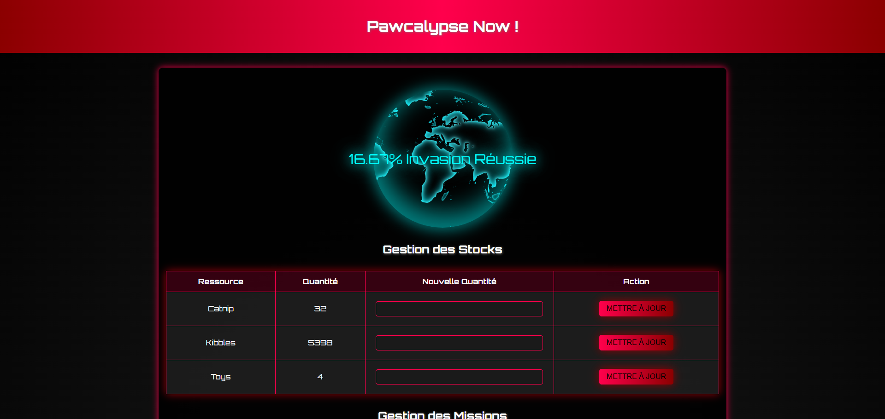

# Pawcalypse - Migration vers MVC et amélioration
Ce projet consiste à migrer le projet Pawcalypse vers une architecture Model-View-Presenter (MVP) tout en appliquant les principes SOLID. Le but est d'améliorer la maintenabilité, la performance et la structure du code en réécrivant des modèles et des contrôleurs, et en optimisant l'utilisation de Twig et des sessions.

## Objectifs du projet :

* Migrer le projet vers une architecture MVC.
* Appliquer les principes SOLID pour améliorer la structure du code.
* Gérer les missions et ressources dans une interface web.
* Optimiser l’utilisation des sessions et de Twig.

## Fonctionnalitées principales : 

* Gestion des missions : Création, modification et suivi des missions.
* Ressources : Allocation et mise à jour des ressources nécessaires pour les missions.
* Sessions utilisateurs : Connexion et gestion des utilisateurs.
* Dashboard : Suivi de l’avancement du soulèvement félin.

## Technologies utilisées

**PHP** pour la logique de backend. 
**Twig** pour le rendu des vues. 
**MySQL** pour la gestion des données. 
**Composer** pour la gestion des dépendances et l'autoloading des classes. 
**Whoops** pour un débogage plus fluide et une gestion des erreurs améliorée. 
